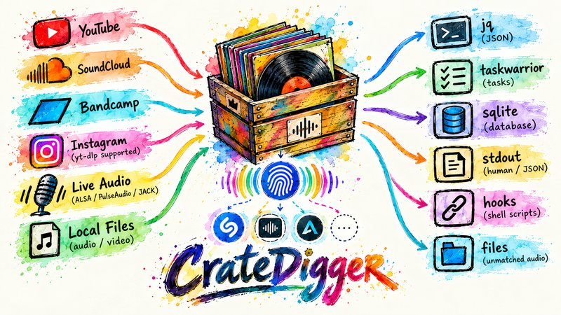

<p align="center">
  
</p>

# CrateDigger

Identify music from online media, live audio, or local media from a short audio segment — directly from the command line.

The tool combines **yt-dlp**, **FFmpeg/pydub**, and pluggable recognition engines: it retrieves online media when given a URL supported by yt-dlp, extracts the requested time window, and sends that short fragment through the configured recognition-engine chain.

I built this because I wanted a small CLI tool for **crate digging across online media, local files, and live audio** — give it a source, optionally point it at a timestamp, and identify the music playing there.

## Supported sources

CrateDigger can recognize music from:

- ▶️ **YouTube**
- ☁️ **SoundCloud**
- 🏕️ **Bandcamp**
- 📸 **Instagram** media URLs supported by yt-dlp
- 🎙️ **Live audio** via ALSA, PulseAudio, or JACK
- 📁 **Local audio/video files**

Online-source support is provided by **yt-dlp**, so the exact URLs that work depend on the installed yt-dlp version and the particular media URL. CrateDigger itself is source-agnostic once the media has been obtained.

## Features

- 🌐 Identify music from URLs supported by yt-dlp
- 📁 Recognize a song from a local media file
- 🎙️ Listen to live audio through ALSA, PulseAudio, or JACK
- ⏱️ Start recognition at an exact timestamp
- ⌛ Choose how many seconds of audio to analyze
- 🔗 Automatically use a YouTube URL's `t=` timestamp when present
- 🦊 Use Firefox cookies through yt-dlp, so age/login/region-gated media can work when your browser session has access
- 🤖 Human-readable output or machine-readable JSON
- 🧹 Temporary downloaded audio is cleaned up automatically
- 🔁 Optionally repeat live recognition with a configurable interval
- 📂 Batch-recognize all supported media files in a directory with `--recursive`
- 👀 Watch a directory for new or changed media files with `--watch`
- 📊 Expose Shazam's recognition score as `confidence` when provided
- ⏳ Add an additional delay after a successful recognition
- 🪝 Lifecycle shell hooks: `startup`, `beforefound`, `afterfound`, `nomatch`, and `error`
- ⚙️ Named profiles with profile-specific settings and hook overrides
- 📋 Inspect available profiles with `--list-profiles`
- 🐛 Debug live captures with `--debug`, keeping temporary WAV fragments in `/tmp`
- 🎧 Keep unmatched audio fragments in a configurable profile directory (or `/tmp` by default) with a `file://` link and expose the path to `nomatch` hooks
- 🔌 Automatically rebuild the PulseAudio/Bluetooth loopback after audio-device reconnects
- 🔄 Fall back to the default/available PulseAudio monitor when Bluetooth is unavailable
- 🔌 Multiple recognition providers with ordered fallback (Shazam, ACRCloud, AudD and Chromaprint/AcoustID)
- ⚙️ Virtual engine keys with provider-specific configuration and credentials
- 🧩 Reuse the same captured audio fragment across all recognition engines in the fallback chain

## Why?

Ever found a track in a long DJ mix, livestream, playlist, or random online video, but don't know what it is?

Instead of playing the source and holding your phone up to Shazam:

```bash
./cratedigger 'https://www.youtube.com/watch?v=VIDEO_ID' -t 47:23
```

That's it.

It's particularly handy for DJ mixes, radio mixes, live sets, remix compilations, old recordings, and random online media.

**Basically: Shazam for crate digging — arbitrary points in online media, local files, or whatever is currently playing.**

## How it works

For online media:

```text
Online URL → yt-dlp → media → FFmpeg/pydub → ShazamIO → track
```

For live audio:

```text
ALSA / PulseAudio / JACK → FFmpeg → PCM WAV → ShazamIO → track
```

The important part is that you don't have to manually download media, cut out a fragment, open a music-recognition service, and feed it the audio. The whole operation is one command.

## Requirements

- Python 3
- [yt-dlp](https://github.com/yt-dlp/yt-dlp) in `$PATH` for online URLs
- FFmpeg
- Python packages:
  - `aiohttp`
  - `pydub`
  - `shazamio`

### Easy install on Ubuntu/Debian

The simplest setup is a small virtual environment:

```bash
sudo apt install python3 python3-venv ffmpeg

git clone https://github.com/hdp1972be-svg/CrateDigger.git
cd CrateDigger

python3 -m venv .venv
. .venv/bin/activate

python -m pip install --upgrade pip
python -m pip install yt-dlp aiohttp pydub shazamio
```

Then run:

```bash
./cratedigger 'https://www.youtube.com/watch?v=VIDEO_ID'
```

For later sessions:

```bash
cd CrateDigger
. .venv/bin/activate
./cratedigger ...
```

If you only use local files, `yt-dlp` is not required. ALSA is available through the normal Linux audio stack; PulseAudio and JACK require their respective audio systems to be installed/configured separately.

## Usage

### Online URLs

Any HTTP(S) URL that the installed yt-dlp can extract can be used:

```bash
./cratedigger 'https://www.youtube.com/watch?v=VIDEO_ID'
./cratedigger 'https://soundcloud.com/artist/track'
./cratedigger 'https://artist.bandcamp.com/track/example'
```

Instagram media URLs are supported when the installed yt-dlp version supports the particular URL.

The default is to analyze a **25-second** fragment.

### Start at a timestamp

```bash
./cratedigger 'https://www.youtube.com/watch?v=VIDEO_ID' -t 10:00
```

The `--time` option accepts seconds, `MM:SS`, or `HH:MM:SS`. If the URL contains a YouTube `t=` parameter, that timestamp is used automatically. An explicit `-t/--time` takes precedence.

### Local media file

```bash
./cratedigger recording.mp3
```

Local media bypasses yt-dlp.

### Recursive batch mode

Recognize every supported media file in a directory:

```bash
./cratedigger --recursive ~/Music/unknown
```

Subdirectories are included automatically by `--recursive`.

### Watch mode

Watch a directory continuously and recognize newly appearing or changed media files:

```bash
./cratedigger --watch ~/Music/incoming
```

Combine it with `--recursive` to watch subdirectories too:

```bash
./cratedigger --watch ~/Music/incoming --recursive
```

Press `Ctrl-C` to stop watching.

### Live audio

```bash
./cratedigger --live --input pulse --device default
./cratedigger --live --input pulse --loop --interval 5 --delay 10
```

During live mode, `p` pauses/resumes, `n` discards the current cycle and starts a fresh recording, and `q` quits. `Ctrl-C` also aborts cleanly and restores the terminal's original settings. A real-time PCM level meter is displayed. Completely silent captures are not sent to Shazam.

#### Debugging live captures

Use `--debug` when diagnosing capture or recognition problems:

```bash
./cratedigger --live --input pulse --device shazam_sink.monitor --debug
```

Debug mode keeps temporary live WAV fragments in `/tmp` instead of deleting them after recognition and prints their paths for inspection. Without `--debug`, temporary live fragments are cleaned up normally.
## Live input options

The `--input` option selects the FFmpeg capture backend:

| Backend | `--input` | `--device` example | Typical use |
|---|---|---|---|
| ALSA | `alsa` | `default` or `hw:1,0` | Direct sound-card / ALSA capture |
| PulseAudio | `pulse` | `default`, `shazam_sink.monitor` | Desktop audio, Bluetooth monitors, Pulse sources |
| JACK | `jack` | JACK input/client name | JACK audio graph |

Examples:

```bash
# ALSA
./cratedigger --live --input alsa --device default
./cratedigger --live --input alsa --device hw:1,0

# PulseAudio
./cratedigger --live --input pulse --device default
./cratedigger --live --input pulse --device shazam_sink.monitor

# JACK
./cratedigger --live --input jack --device system:capture_1
```

`--device` is passed directly to FFmpeg as the input device/source name. The exact names available therefore depend on the audio system and its current configuration. If you are unsure what to use, inspect the devices/sources with the tools provided by your audio stack (for example `pactl list short sources` for PulseAudio).

#### PulseAudio system-output capture

A convenient way to feed normal system audio into Shazam is to create a PulseAudio null sink:

```bash
pactl load-module module-null-sink \
    sink_name=shazam_sink \
    sink_properties=device.description=ShazamSink
```

Then list the available monitor sources:

```bash
pactl list short sources
```

Route the desired monitor into the null sink:

```bash
pactl load-module module-loopback \
    source=bluez_sink.CA_D5_01_BE_BA_6C.a2dp_sink.monitor \
    sink=shazam_sink \
    latency_msec=100
```

The BlueZ monitor name above is an example; the actual name depends on the active device.

Then:

```bash
./cratedigger --live --input pulse --device shazam_sink.monitor --loop
```

## Recognition engines

CrateDigger separates the **recognition engine key** used by a profile from the actual provider implementation. A profile selects an ordered list of virtual engine keys with `engines`:

```ini
[PROFILE default]
engines = shazam

[PROFILE acrcloud_only]
engines = acrcloud

[PROFILE fallback]
engines = shazam, acrcloud

[PROFILE fallback_reverse]
engines = acrcloud, shazam
```

The engines are tried from left to right. CrateDigger captures the audio fragment **once** and reuses the same fragment for every engine in the chain.

### Detection mode

Profiles support two recognition modes:

    [PROFILE default]
    engines = shazam, acrcloud, audd
    detection_mode = firstmatch

- **`firstmatch`** (default): engines are queried from left to right. The first successful match stops recognition; a no-match or provider error continues to the next engine.
- **`all`**: every configured engine is queried with the same audio fragment. Every successful provider result is reported independently, and the `beforefound` / `afterfound` hooks are executed separately for each match.

In `all` mode, providers that return no match or an error do not produce a match hook. The existing `error` hook remains reserved for the case where no configured provider successfully answered at all.


The current providers are:

| Provider | Engine key | Configuration |
|---|---|---|
| Shazam | `shazam` | Uses ShazamIO |
| ACRCloud | `acrcloud` | ACRCloud Identify API |
| AudD | `audd` | AudD music recognition API |
| Chromaprint/AcoustID | `chromaprint` | Local Chromaprint fingerprint + AcoustID lookup |

### Virtual engine configuration

Engine definitions live in `.cratediggerrc`:

```ini
[ENGINE shazam]
provider = shazam

[ENGINE acrcloud]
provider = acrcloud
host = identify-<your-region>.acrcloud.com
access_key = your-acrcloud-access-key
access_secret = your-acrcloud-access-secret

[ENGINE audd]
provider = audd
api_token = your-audd-api-token

[ENGINE chromaprint]
provider = chromaprint
client = your-acoustid-application-api-key
```

The engine key is intentionally separate from the provider name. This makes it possible to configure multiple virtual instances of the same provider:

```ini
[ENGINE acrcloud_radio]
provider = acrcloud
host = identify-<your-region>.acrcloud.com
access_key = another-access-key
access_secret = another-access-secret

[PROFILE radio]
engines = shazam, acrcloud_radio
```

Keep real API credentials out of a public repository.

### Chromaprint / AcoustID

The `chromaprint` provider generates an audio fingerprint locally with the `fpcalc` utility and sends that fingerprint to the AcoustID lookup service. AcoustID requires an application API key in the `client` parameter; register an application rather than putting a temporary example key into the configuration. citeturn0search0

Install Chromaprint so `fpcalc` is available in `$PATH`. The Chromaprint project recommends `fpcalc` when an application only needs to generate fingerprints for AcoustID. citeturn0search1

**Important limitation:** AcoustID is designed for identifying full audio files and explicitly does not currently support short audio snippets as its primary use case. CrateDigger normally sends short fragments, so `chromaprint` is best treated as an optional provider for sufficiently long/full-file input rather than a drop-in replacement for Shazam, ACRCloud or AudD. citeturn0search4

Example:

```ini
[ENGINE chromaprint]
provider = chromaprint
client = your-acoustid-application-api-key

[PROFILE acoustid]
engines = chromaprint
```

AcoustID's web service is free for non-commercial applications and is rate-limited; its current guidance says not to exceed 3 requests per second. citeturn0search0turn0search2

### Fallback semantics

Each engine can produce one of three meaningful outcomes:

1. **Match** — a track was identified; the chain stops.
2. **No match** — the provider answered successfully but found nothing; CrateDigger continues with the next engine.
3. **Error** — the provider could not complete recognition; the error is shown and CrateDigger continues with the next engine.

If at least one provider answered successfully but all providers returned no match, the final result is a normal `No match`.

```text
capture 20s
    ↓
Shazam
    ├── match ───────────────→ Track found
    └── no match
          ↓
       ACRCloud
          ├── match ─────────→ Track found
          └── no match ──────→ No match
```

The successful match also records the engine that produced it, so terminal output identifies the provider:

```text
Recognition engine raadplegen: shazam...
Recognition engine raadplegen: acrcloud...

✅ Nummer gevonden via acrcloud
Title   : Jordan
Artist  : Mr Assister
...
```

The normalized track result is then passed to the existing hooks, so `afterfound` does not need provider-specific orchestration.

## Hooks

CrateDigger hooks are configured in `.cratediggerrc` under `[HOOKS]`. Hooks are shell commands that let you connect recognition events to your own tools, scripts, databases, queues, or services.

The first existing configuration file from these locations is used:

```text
./.cratediggerrc
~/.cratediggerrc
~/.config/cratedigger/cratediggerrc
~/.config/cratedigger/.cratediggerrc
```

Profile hooks can override the corresponding global `[HOOKS]` value.

### Lifecycle

CrateDigger supports five lifecycle events:

- `startup` — runs once when CrateDigger starts, before audio/network work. Useful for preparing external resources such as PulseAudio sinks and loopbacks.
- `beforefound` — runs after an engine identifies a track, immediately before `afterfound`.
- `afterfound` — runs after a new recognition. Repeated identical matches are suppressed.
- `nomatch` — runs when the configured engine chain completes without identifying the fragment.
- `error` — runs for recognition/provider/network errors.

In `detection_mode = all`, `beforefound` and `afterfound` are executed separately for each successful provider match.

Example:

```ini
[HOOKS]
startup = shell exec ~/bin/cratedigger-startup
beforefound = shell exec printf 'candidate: %s\\n' "$SHAZAM_ARTIST - $SHAZAM_RECORD"
afterfound = shell exec task add "%artist %record %id %date" +MUSIC
nomatch = shell exec logger -t cratedigger "no match: $SHAZAM_SOURCE"
error = shell exec logger -t cratedigger "error $SHAZAM_EXIT_CODE: $SHAZAM_ERROR"
```

A profile can override individual hooks:

```ini
[PROFILE radio]
afterfound = shell exec ~/bin/radio-found.sh
nomatch = shell exec ~/bin/radio-miss.sh
```

### Hook variables

CrateDigger exports recognition data to the hook environment. Common variables include:

- `$SHAZAM_ARTIST`
- `$SHAZAM_RECORD`
- `$SHAZAM_ID`
- `$SHAZAM_GENRE`
- `$SHAZAM_CONFIDENCE`
- `$SHAZAM_DATE`
- `$SHAZAM_URL`
- `$YOUTUBE_ID`
- `$SHAZAM_SOURCE`
- `$SHAZAM_SOURCE_TYPE`
- `$SHAZAM_ERROR` — error text for `error` hooks
- `$SHAZAM_EXIT_CODE` — relevant exit code for `nomatch`/`error`
- `$SHAZAM_AUDIO_FILE` — saved WAV path for an unmatched fragment
- `$SHAZAM_AUDIO_URL` — the same path as a `file://` URL

For every scalar value in the returned `track` object, CrateDigger also creates a `SHAZAM_*` variable by flattening nested dictionaries and arrays. Arrays use zero-based numeric path components; nested objects are flattened using uppercase underscore-separated names.

The complete provider track dictionary is available as compact JSON in `$SHAZAM_JSON`, with `$SHAZAM_TRACK_JSON` as an alias.

### Placeholders

Hook commands support `%placeholders` in addition to environment variables. Every `SHAZAM_*` value can be referenced by removing the `SHAZAM_` prefix and using lowercase.

| Placeholder | Environment variable | Meaning |
|---|---|---|
| `%artist` | `$SHAZAM_ARTIST` | Artist name |
| `%record` | `$SHAZAM_RECORD` | Track title |
| `%id` | `$SHAZAM_ID` | Provider-specific track identifier |
| `%provider` | `$SHAZAM_PROVIDER` | Recognition provider that produced the match |
| `%genre` | `$SHAZAM_GENRE` | Primary genre |
| `%confidence` | `$SHAZAM_CONFIDENCE` | Recognition confidence/score when available |
| `%year` | `$SHAZAM_YEAR` | Release year when available |
| `%date` | `$SHAZAM_DATE` | Recognition date |
| `%url` | `$SHAZAM_URL` | Original source URL |
| `%youtubeid` | `$YOUTUBE_ID` | YouTube video ID when present |
| `%source` | `$SHAZAM_SOURCE` | Original source/path |
| `%sourcetype` | `$SHAZAM_SOURCE_TYPE` | `file`, `url`, or `live` |
| `%audio_file` | `$SHAZAM_AUDIO_FILE` | Saved audio fragment path |
| `%audio_url` | `$SHAZAM_AUDIO_URL` | Saved audio fragment as `file://` URL |
| `%error` | `$SHAZAM_ERROR` | Error text for error hooks |
| `%exit_code` | `$SHAZAM_EXIT_CODE` | CrateDigger exit/error code |

Prefix a placeholder with `U` to uppercase its expanded value. For example, `%Uprovider` returns `SHAZAM`, while `%Uartist` uppercases the artist name.

Arbitrary nested provider data is available through the same flattening mechanism. For example:

```text
images.coverarthq      → $SHAZAM_IMAGES_COVERARTHQ      → %images_coverarthq
sections[0].type       → $SHAZAM_SECTIONS_0_TYPE       → %sections_0_type
artists[0].name        → $SHAZAM_ARTISTS_0_NAME        → %artists_0_name
```

The complete provider track dictionary is also available as `$SHAZAM_JSON` / `$SHAZAM_TRACK_JSON`, and therefore as `%json` / `%track_json`.

### Provider metadata

The normalized track result records the provider that produced the match. The `%provider` / `$SHAZAM_PROVIDER` value identifies the actual recognition provider, such as `shazam`, `acrcloud`, `audd`, or `chromaprint`.

The `%id` / `$SHAZAM_ID` value is provider-specific. For example, a Shazam match provides its Shazam track key, ACRCloud provides its ACRID, and AudD provides its `song_id` when available.

Provider metadata is also retained in the normalized recognition result. The generic hook variables above therefore remain usable as the provider chain evolves without requiring provider-specific hook commands.

For example:

```ini
afterfound = shell exec printf '%s | %s | provider=%s\\n' "%artist" "%record" "%provider"
```

With `detection_mode = all`, the same audio fragment can produce separate hook invocations for multiple providers.

### Examples

#### Taskwarrior MUSIC queue

A simple `afterfound` hook can turn every newly recognized track into a Taskwarrior task:

```ini
[HOOKS]
afterfound = shell exec task add "%artist %record %id %date" +MUSIC
```

This keeps recognition and acquisition separate: CrateDigger identifies the track, while Taskwarrior becomes the discovery queue.

#### CSV output

A hook can also append one correctly quoted CSV row per recognized track. This example creates the header on first use and includes the recognition provider:

```ini
[HOOKS]
afterfound = shell exec sh -c 'csv="$HOME/.local/share/cratedigger/tracks.csv"; mkdir -p "$(dirname "$csv")"; if [ ! -f "$csv" ]; then printf "%s\\n" "artist,title,genre,id,date,url,youtubeid,provider" > "$csv"; fi; jq -rn --arg artist "$SHAZAM_ARTIST" --arg title "$SHAZAM_RECORD" --arg genre "$SHAZAM_GENRE" --arg id "$SHAZAM_ID" --arg date "$SHAZAM_DATE" --arg url "$SHAZAM_URL" --arg youtubeid "$YOUTUBE_ID" --arg provider "$SHAZAM_PROVIDER" "[\\$artist,\\$title,\\$genre,\\$id,\\$date,\\$url,\\$youtubeid,\\$provider] | @csv" >> "$csv"'
```

The resulting file is:

```text
artist,title,genre,id,date,url,youtubeid,provider
Example Artist,Example Song,Dance,123456789,2026-09-26,https://example.com/source,VIDEO_ID,shazam
```

Using `jq @csv` ensures that commas, quotes, and other CSV-sensitive characters are escaped correctly.

For a larger pipeline, point `afterfound` at your own script instead:

```ini
[HOOKS]
afterfound = shell exec ~/.local/bin/cratedigger-found
```

The script can then update Taskwarrior, ingest a database, call an API, or perform several actions at once.


#### SQLite

A simple SQLite ingest can be done directly from an `afterfound` hook:

```bash
sqlite3 music.db \
  "INSERT INTO tracks (artist,title,shazam_id,found_at) \
   VALUES ('$SHAZAM_ARTIST','$SHAZAM_RECORD','$SHAZAM_ID','$SHAZAM_DATE');"
```

For production use, prefer parameterized/prepared statements in your own script rather than constructing SQL directly from shell-expanded recognition strings.

#### PostgreSQL

PostgreSQL works just as naturally:

```bash
psql music \
  -c "INSERT INTO tracks (artist,title,shazam_id,found_at) \
      VALUES ('$SHAZAM_ARTIST','$SHAZAM_RECORD','$SHAZAM_ID','$SHAZAM_DATE');"
```

#### HTTP endpoint

The same recognition data can be sent to a local or network service:

```bash
curl -X POST http://localhost:8080/tracks \
  -d "artist=$SHAZAM_ARTIST&title=$SHAZAM_RECORD&id=$SHAZAM_ID"
```

For anything more involved, point the hook at your own script:

```ini
[HOOKS]
afterfound = shell exec ~/.local/bin/cratedigger-found
```

The script can then update Taskwarrior, ingest a database, call an API, or perform several actions at once.

#### JSON and CSV pipelines

For automation, JSON output is useful as a stable machine-readable representation of each recognition. A shell pipeline can transform recognition data with normal Unix tools such as `jq`.

For example, keep a JSONL history of recognized tracks:

```ini
[HOOKS]
afterfound = shell exec sh -c 'printf "%s\\n" "$(jq -nc --arg artist "$SHAZAM_ARTIST" --arg title "$SHAZAM_RECORD" --arg genre "$SHAZAM_GENRE" --arg id "$SHAZAM_ID" --arg date "$SHAZAM_DATE" --arg url "$SHAZAM_URL" --arg youtubeid "$YOUTUBE_ID" --arg source "$SHAZAM_SOURCE" --arg sourcetype "$SHAZAM_SOURCE_TYPE" '''{artist:$artist,title:$title,genre:$genre,id:$id,date:$date,url:$url,youtubeid:$youtubeid,source:$source,source_type:$sourcetype}''')" >> ~/.local/share/cratedigger.jsonl'
```

JSONL is preferable to appending separate JSON objects to one `.json` file because every line remains an independent valid JSON value.

To turn recognition data into CSV, `jq` can produce properly quoted CSV fields:

```bash
jq -r '[.artist,.title,.genre,.id,.date,.url,.youtubeid] | @csv'
```

The practical `afterfound` CSV hook above already demonstrates how to append one correctly quoted row per recognition and create the header on first use. With `detection_mode = all`, each provider match is written as its own row.

For a larger or more complex pipeline, point `afterfound` at a small script instead; that keeps quoting and file management easier to maintain.


### Profiles

Profiles can be defined in `.cratediggerrc`. The built-in `default` profile keeps the current command-line defaults, so existing behaviour is unchanged.

```ini
[PROFILE default]
duration = 25
interval = 5
delay = 0
input = alsa
device = default
loop = false
json = false
keep_temp = false
live = false
recursive = false

[PROFILE radio]
live = true
input = pulse
device = shazam_sink.monitor
duration = 20
interval = 10
loop = true
```

Use a profile with:

```bash
./cratedigger --profile radio
```

Inspect configured profiles and their effective settings with:

```bash
./cratedigger --list-profiles
```

Explicit command-line options still override the profile values.

### Automated PulseAudio/Bluetooth capture

CrateDigger includes `scripts/setup-radio-audio.sh` for preparing a PulseAudio capture path before live recognition. The script:

1. Creates a `shazam_sink` null sink when needed.
2. Finds a Bluetooth A2DP monitor source unless one is explicitly configured.
3. Falls back to an explicitly configured PulseAudio source or the default PulseAudio sink monitor when Bluetooth is unavailable.
4. Creates a PulseAudio loopback from the selected source into `shazam_sink`.
5. Uses **100 ms loopback latency by default**.
6. Removes stale loopbacks feeding `shazam_sink` before creating the current route.
7. The reconnect watcher reruns the setup when audio devices change, so a returning Bluetooth device is selected automatically.

The 100 ms default is intentional: lower loopback latency can produce unstable/noisy capture on some PulseAudio/Bluetooth setups even when direct recording from the Bluetooth monitor is clean. The setup script also removes stale loopbacks feeding `shazam_sink` before creating the current route, so a Bluetooth reconnect does not leave an old monitor connected.

An automatic radio profile can therefore be as simple as:

```ini
[PROFILE radio]
startup = shell exec bash scripts/setup-radio-audio.sh
live = true
input = pulse
device = shazam_sink.monitor
duration = 20
interval = 10
delay = 5
loop = true
```

The setup script accepts these environment variables:

- `SHAZAM_SINK_NAME` — null-sink name; default `shazam_sink`
- `SHAZAM_SINK_DESCRIPTION` — sink description; default `ShazamSink`
- `SHAZAM_LOOPBACK_LATENCY_MS` — loopback latency; default `100`
- `SHAZAM_AUDIO_SOURCE` — explicit PulseAudio source override
- `SHAZAM_AUDIO_FALLBACK_SOURCE` — explicit fallback source used when no Bluetooth A2DP monitor is available

The source override deliberately uses `SHAZAM_AUDIO_SOURCE`; `SHAZAM_SOURCE` is reserved by CrateDigger for the original recognition source exposed to hooks.

Manual setup is also possible:

```bash
pactl load-module module-null-sink \
    sink_name=shazam_sink \
    sink_properties=device.description=ShazamSink

pactl list short sources

pactl load-module module-loopback \
    source=bluez_sink.CA_D5_01_BE_BA_6C.a2dp_sink.monitor \
    sink=shazam_sink \
    latency_msec=100
```

Then capture from `shazam_sink.monitor`:

If Bluetooth is unavailable, the automated setup uses `SHAZAM_AUDIO_FALLBACK_SOURCE` when set; otherwise it tries the default PulseAudio sink monitor and then another available monitor source. This keeps the `radio` profile usable when the Bluetooth device is temporarily disconnected.

```bash
./cratedigger --live --input pulse --device shazam_sink.monitor --loop
```

## JSON output

```bash
./cratedigger 'https://www.youtube.com/watch?v=VIDEO_ID' --json
```

Successful recognition returns the complete Shazam track object:

```json
{
  "status": "found",
  "track": {
    "title": "Example Song",
    "subtitle": "Example Artist"
  },
  "confidence": 0.94
}
```

The abbreviated `track` object above is illustrative; CrateDigger preserves all fields returned by Shazam. The `confidence` field is included as `null` when no recognition score was available.

With no match:

```json
{"status":"no_match"}
```

## License

See the repository license if one is added.
